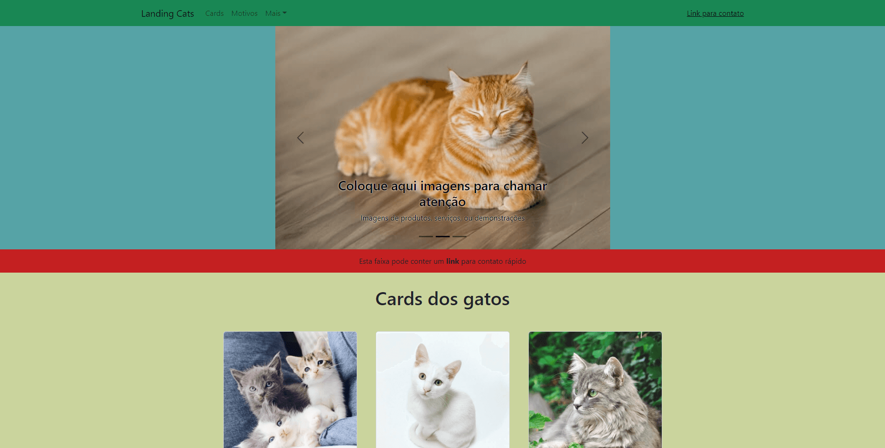

# Landing Cats

### Seja bem vindo ao projeto Landing Cats!

----

Este é um projeto desenvolvido por mim, **Lucas Bitencourt**, como forma de praticar e demonstrar minhas habilidades.

O projeto é uma simulação de uma landing page, utilizando como exemplo, diversos adoráveis gatos. A landing page foi construída utilizando React e Bootstrap para React. A página é responsiva, e pensada para funcionar em diferentes tamanhos de telas.

 

## Sumário

- [Objetivo](#objetivo)
- [Resultado](#resultado)
- [Instalação](#instalação)
- [Conclusão](#conclusão)

#### Objetivo

O objetivo deste projeto, foi demonstrar minhas habilidades abaixo:

- React
- Bootstrap

#### Resultado

Este é o resultado do projeto:

Você também pode visualizar o projeto rodando clicando [aqui](https://lucasbitencourt.com.br/lb-cats/).

 

## Abaixo, instruções para ter acesso ao código

---

#### Instalação

##### Clonando o repositório localmente

1. Clone o repositório
     - `git clone git@github.com:xlucasbitencourt/lb-cats.git`
     - Entre na pasta do repositório que você acabou de clonar:
     - `cd lb-cats`    
   
  
2. Instale as dependências e inicialize o projeto
    - `npm install`
    - `npm start`

 

## Conclusão

Este é um projeto desenvolvido para aprendizado. Caso queira contribuir com algum feedback, sinta-se a vontade para comentar, ou entre em contato comigo:

  